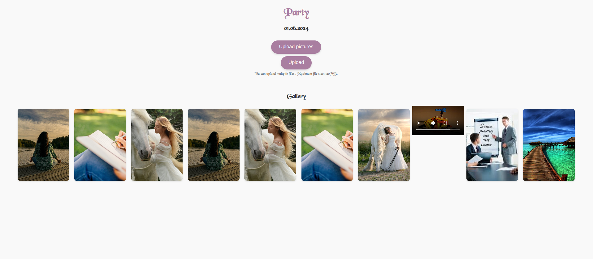

# Party Photo Gallery
This is a simple node application using AWS S3 to store and display uploaded images and videos from parties. 
On upload, files can be previewed before upload.
The images can be opened in a lightbox2 view.


# Dependencies
Install the dependencies on an Debian-based EC2 instance or server with: 
```
./install_deps.sh
```

You 

## Video conversion 
Mov files are being converted into mp4 files for better browser support. 

A demo page looks like this:



# Deployment
Define your secrets in a .env file:
```
AWS_ACCESS_KEY_ID=NOT_A_SECRET
AWS_SECRET_ACCESS_KEY=NOT_A_SECRET
AWS_REGION=region
S3_BUCKET_NAME=bucket_name
AUTH_PASSWORD=NOT_A_SECRET
```

You can copy the `sample.env` file and rename it to `.env`.

Start the application with:
`pm2 start app.js --name party-photo-gallery`

Save the state:
```
pm2 save
```

Get the logs with:
```
pm2 logs party-photo-gallery
```

On script restart with:
```
pm2 restart party-photo-gallery
```

Install the certificate:
sudo certbot --nginx -d example.com

Use the nginx configuration from the folder `nginx`.

